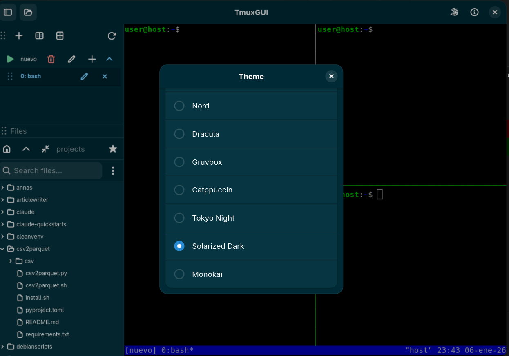
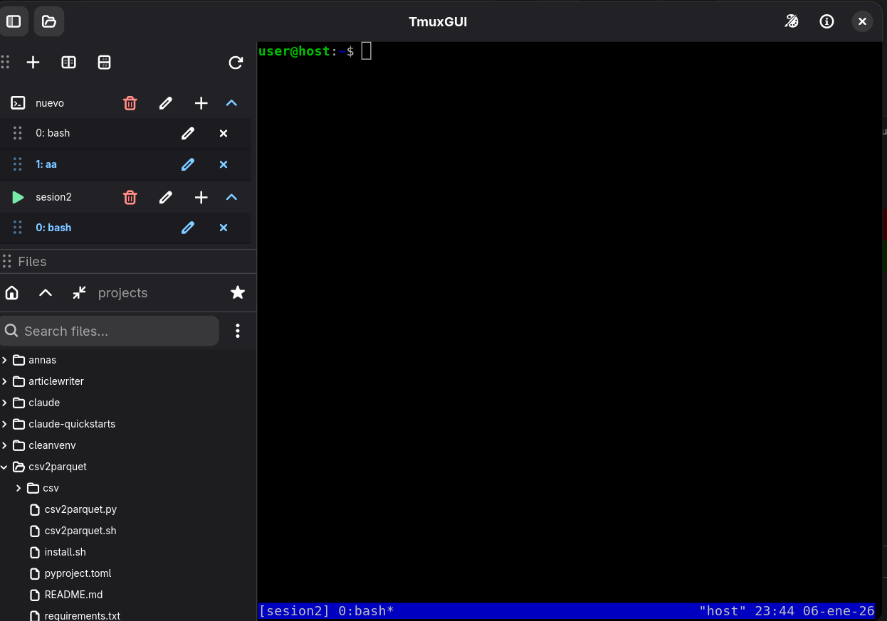
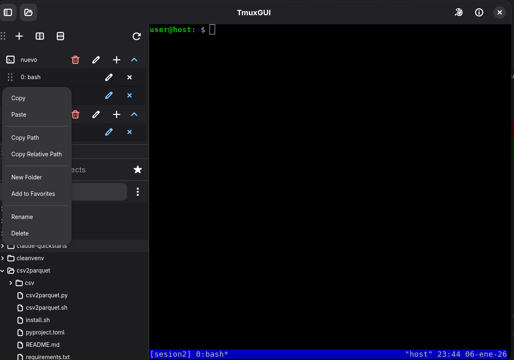

# gnome-tmux

<p align="center">
  
</p>

<p align="center">
  <strong>GNOME native frontend for tmux</strong><br>
  Modern GTK4 + Libadwaita interface for managing tmux sessions
</p>

---

## Features

### Session Management

| Feature | Description |
|---------|-------------|
| **List sessions** | Shows all tmux sessions with attached/detached status |
| **Create session** | Dialog to create new session with custom name |
| **Delete session** | Confirmation dialog before terminating session |
| **Rename session** | Inline rename via edit button |
| **Auto-refresh** | Sessions update every 5 seconds automatically |
| **Visual indicators** | Play icon for attached sessions, terminal icon for detached |
| **Expandable tree** | Click session to expand and see all windows |

### Window Management

| Feature | Description |
|---------|-------------|
| **List windows** | Shows all windows per session in expandable tree |
| **Create window** | Add new windows with optional custom name |
| **Rename window** | Edit button to rename any window |
| **Close window** | Sends `exit` command for clean shutdown |
| **Drag & drop** | Reorder windows within a session by dragging |
| **Visual indicators** | Active window shown in bold with accent color |
| **Quick attach** | Click any window to attach terminal immediately |

### Remote Sessions (SSH)

| Feature | Description |
|---------|-------------|
| **SSH connections** | Connect to remote tmux sessions via SSH |
| **Host management** | Save, edit, and delete remote hosts |
| **Quick connect** | Click saved host to connect instantly |
| **Custom names** | Give friendly names to saved connections |
| **Persistent storage** | Hosts saved to `~/.config/gnome-tmux/remote_hosts.json` |
| **Session operations** | Create, rename, attach to remote sessions |
| **ControlMaster** | Persistent SSH connections for performance |

### Integrated Terminal

| Feature | Description |
|---------|-------------|
| **VTE terminal** | Full-featured embedded terminal emulator |
| **Auto-attach** | Automatically connects to selected session/window |
| **tmux keybindings** | Full support for all tmux shortcuts |
| **Split panes** | Toolbar buttons for horizontal/vertical splits |
| **Detach handling** | Returns to welcome screen on `Ctrl+B d` |

### File Browser

The integrated file browser provides VS Code-style navigation:

#### Navigation
| Feature | Description |
|---------|-------------|
| **Home button** | Jump to home directory |
| **Up button** | Navigate to parent directory |
| **Collapse all** | Collapse all expanded directories |
| **Recursive tree** | Expand/collapse folders inline |
| **Hidden files** | Automatically hidden (dotfiles) |

#### Search
| Mode | Description |
|------|-------------|
| **By name** | Find files matching name pattern (`find`) |
| **By regex** | Search using regular expressions |
| **By content** | Search file contents (`grep`) |

#### Favorites System
| Feature | Description |
|---------|-------------|
| **Add to favorites** | Star button or context menu |
| **Quick navigation** | Jump to favorite folders instantly |
| **Persistent storage** | Saved in `~/.config/gnome-tmux/favorites.json` |
| **Remove favorites** | Delete from favorites menu |

#### Context Menu (Right-click)
| Action | Description |
|--------|-------------|
| **Copy** | Copy file/folder to internal clipboard |
| **Paste** | Paste copied item (auto-rename on conflict) |
| **Copy Path** | Copy absolute path to system clipboard |
| **Copy Relative Path** | Copy path relative to current root |
| **New Folder** | Create new directory (folders only) |
| **Add to Favorites** | Add folder to favorites (folders only) |
| **Rename** | Rename file or folder via dialog |
| **Delete** | Move to `~/.trash` (safe delete) |

#### Drag & Drop
| Feature | Description |
|---------|-------------|
| **Drag to terminal** | Drag any file or folder to paste its path in the terminal |
| **Search results** | Navigate to file location button |

### Themes

| Feature | Description |
|---------|-------------|
| **Theme selector** | Click palette icon in header to change theme |
| **10 color schemes** | Default, Dark, Light, Nord, Dracula, Gruvbox, Catppuccin, Tokyo Night, Solarized Dark, Monokai |
| **Persistent settings** | Theme preference saved to `~/.config/tmuxgui/settings.json` |
| **Auto-apply** | Theme applied automatically on startup |

### UI/UX

| Feature | Description |
|---------|-------------|
| **GNOME native** | GTK4 + Libadwaita design language |
| **Adaptive layout** | Resizable sidebars with paned containers |
| **Toggle sidebars** | `F9` for sessions, `F10` for file browser |
| **Animated transitions** | Smooth open/close animations |
| **Auto-show sidebar** | Move cursor to left edge to reveal hidden sidebar |
| **Section reordering** | Drag handle to swap Sessions/Files positions |
| **Toast notifications** | Non-intrusive feedback messages |
| **Compact rows** | Custom CSS for dense information display

## Screenshots

<table>
  <tr>
    <td></td>
    <td></td>
  </tr>
  <tr>
    <td></td>
    <td></td>
  </tr>
  <tr>
    <td></td>
    <td></td>
  </tr>
</table>

## Requirements

### System Dependencies
- Python 3.12+
- GTK 4.0
- Libadwaita 1.0
- VTE 3.91 (terminal emulator)
- tmux

### Python Dependencies
- PyGObject (gi)

## Installation

### Debian/Ubuntu

```bash
# Install system dependencies
sudo apt install \
    python3-gi \
    python3-gi-cairo \
    gir1.2-gtk-4.0 \
    gir1.2-adw-1 \
    gir1.2-vte-3.91 \
    tmux

# Clone the repository
git clone https://github.com/vdirienzo/gnome-tmux.git
cd gnome-tmux

# Run the application
./run.py
```

### Fedora

```bash
# Install system dependencies
sudo dnf install \
    python3-gobject \
    gtk4 \
    libadwaita \
    vte291-gtk4 \
    tmux

# Clone and run
git clone https://github.com/vdirienzo/gnome-tmux.git
cd gnome-tmux
./run.py
```

### Arch Linux

```bash
# Install system dependencies
sudo pacman -S \
    python-gobject \
    gtk4 \
    libadwaita \
    vte4 \
    tmux

# Clone and run
git clone https://github.com/vdirienzo/gnome-tmux.git
cd gnome-tmux
./run.py
```

### Flatpak (Universal)

**Requirements:** tmux must be installed on the host system (the Flatpak uses the host's tmux via `flatpak-spawn`).

```bash
# Install flatpak-builder if needed
sudo apt install flatpak flatpak-builder tmux  # Debian/Ubuntu
sudo dnf install flatpak flatpak-builder tmux  # Fedora

# Add Flathub repository
flatpak remote-add --if-not-exists flathub https://dl.flathub.org/repo/flathub.flatpakrepo

# Install GNOME SDK (if not already installed)
flatpak install org.gnome.Sdk//49

# Clone and build
git clone https://github.com/vdirienzo/gnome-tmux.git
cd gnome-tmux
./build-flatpak.sh

# Run
flatpak run io.github.vdirienzo.TmuxGUI
```

#### Export Flatpak Bundle

To create a distributable `.flatpak` file:

```bash
flatpak build-bundle ~/.local/share/flatpak/repo tmuxgui.flatpak io.github.vdirienzo.TmuxGUI
```

Install on another machine:

```bash
flatpak install tmuxgui.flatpak
```

## Usage

### Basic Workflow

1. **Launch the application** - `./run.py`
2. **Sessions appear in sidebar** - Existing tmux sessions are listed automatically
3. **Click a session** - Expands to show windows
4. **Click a window** - Terminal attaches to that window
5. **Create sessions** - Click `+` button in header
6. **Manage windows** - Use buttons on each session/window row

### Keyboard Shortcuts

#### Application Shortcuts

| Shortcut | Action |
|----------|--------|
| `F9` | Toggle sessions sidebar |
| `F10` | Toggle file browser sidebar |

#### tmux Shortcuts (in terminal)

| Shortcut | Action |
|----------|--------|
| `Ctrl+B d` | Detach from tmux session |
| `Ctrl+B c` | Create new window (in tmux) |
| `Ctrl+B n` | Next window |
| `Ctrl+B p` | Previous window |
| `Ctrl+B %` | Split pane horizontally |
| `Ctrl+B "` | Split pane vertically |
| `Ctrl+B o` | Cycle through panes |
| `Ctrl+B x` | Kill current pane |
| `Ctrl+B z` | Toggle pane zoom |
| `Ctrl+B [` | Enter copy mode |
| `Ctrl+B ]` | Paste from buffer |

*Standard tmux keybindings work in the embedded terminal*

### Recommended tmux Configuration

For the best experience with gnome-tmux, add this configuration to your `~/.tmux.conf`:

```bash
# Enable full mouse support (select panes, resize, scroll)
set -g mouse on

# Change prefix from Ctrl+b to Ctrl+a (more comfortable, like screen)
set -g prefix C-a
unbind C-b
bind C-a send-prefix

# Intuitive shortcuts for splitting windows
bind v split-window -h  # Split vertically with v
bind h split-window -v  # Split horizontally with h
unbind '"'
unbind %

# Quick reload configuration (without restarting tmux)
bind r source-file ~/.tmux.conf \; display "Configuration reloaded!"

# 256 color support (improves themes in Vim/Neovim)
set -g default-terminal "screen-256color"

# Vim-style keys in copy mode
setw -g mode-keys vi

# Reduce Escape delay (useful with Vim/Neovim)
set -sg escape-time 0

# Navigate panes with Alt + arrows (no prefix needed)
bind -n M-Left select-pane -L
bind -n M-Right select-pane -R
bind -n M-Up select-pane -U
bind -n M-Down select-pane -D

# Better looking status bar
set -g status-bg blue
set -g status-fg white
```

After saving, reload with `tmux source-file ~/.tmux.conf` or restart tmux.

### Drag and Drop

- **Drag to terminal**: Drag any file or folder from the file browser to paste its path in the terminal
- **Reorder windows**: Drag a window row to swap positions within the same session
- **Reorder sidebar**: Drag the handle (≡) on section headers to swap Sessions/Files sections

## Project Structure

```
tmuxgui/
├── src/
│   └── gnome_tmux/
│       ├── __init__.py
│       ├── main.py              # Application entry point
│       ├── window.py            # Main window with sidebar and terminal
│       ├── tmux_client.py       # Tmux subprocess wrapper (local + remote)
│       ├── remote_hosts.py      # SSH host management
│       ├── themes.py            # Theme manager
│       └── widgets/
│           ├── __init__.py
│           ├── session_row.py       # Session and window row widgets
│           ├── remote_session_row.py # Remote session widgets
│           ├── file_tree.py         # File browser widget
│           └── terminal_view.py     # VTE terminal wrapper
├── data/
│   └── icons/                   # Application icons
├── run.py                       # Development launcher
├── pyproject.toml               # Project configuration
└── README.md
```

## Architecture

### Components

| Component | Description |
|-----------|-------------|
| `GnomeTmuxApplication` | Adw.Application subclass, handles lifecycle |
| `MainWindow` | Main window with sidebar (sessions + files) and terminal |
| `TmuxClient` | Wrapper for local tmux CLI commands via subprocess |
| `RemoteTmuxClient` | SSH-based tmux client with ControlMaster |
| `RemoteHostsManager` | Persistent storage for saved SSH hosts |
| `SessionRow` | Adw.ExpanderRow showing session with child windows |
| `RemoteSessionRow` | Session row for remote SSH connections |
| `WindowRow` | Adw.ActionRow for individual tmux windows |
| `FileTree` | Recursive file browser with CRUD operations |
| `TerminalView` | VTE terminal with tmux attach functionality |
| `ThemeManager` | Color scheme management and persistence |

### Data Flow

```
User Action → Widget Signal → MainWindow Handler → TmuxClient → tmux CLI
                                    ↓
                              Refresh UI ← Parse Output
```

## Development

### Running from Source

```bash
# Direct execution
./run.py

# With PYTHONPATH
PYTHONPATH=src python3 -m gnome_tmux.main

# Debug mode (verbose output)
G_MESSAGES_DEBUG=all ./run.py
```

### Code Quality

```bash
# Lint with ruff
uvx ruff check src/

# Auto-fix issues
uvx ruff check --fix src/

# Security scan with semgrep
semgrep scan src/
```

### Project Configuration

The project uses `pyproject.toml` for configuration:
- **ruff**: Linting with E, F, W, I rules (E402 ignored for gi.require_version pattern)

## Contributing

1. Fork the repository
2. Create a feature branch (`git checkout -b feature/amazing-feature`)
3. Commit your changes (`git commit -m 'feat: add amazing feature'`)
4. Push to the branch (`git push origin feature/amazing-feature`)
5. Open a Pull Request

### Commit Convention

We use [Conventional Commits](https://www.conventionalcommits.org/):

- `feat:` New features
- `fix:` Bug fixes
- `docs:` Documentation changes
- `style:` Code style changes (formatting)
- `refactor:` Code refactoring
- `test:` Adding tests
- `chore:` Maintenance tasks

## Changelog

### [0.4.0] - 2026-01-07

#### Added

**Remote Sessions (SSH)**
- Connect to remote tmux sessions via SSH
- Host management: save, edit, delete connections
- Quick connect from saved hosts list
- Custom names for saved connections
- Persistent storage in `~/.config/gnome-tmux/remote_hosts.json`
- Create, rename, attach to remote sessions
- SSH ControlMaster for persistent connections
- Async loading to keep UI responsive

**File Browser**
- Drag folders to terminal (paste path, same as files)

**UI Improvements**
- Compact sidebar buttons (linked button groups)
- Redesigned session dialog with host management
- Fixed GTK focus-out warnings on dialog close

### [0.3.0] - 2026-01-06

#### Added

**Theme System**
- Theme selector button in header bar (palette icon)
- 10 built-in color schemes:
  - Default (follows system)
  - Dark / Light (forced modes)
  - Nord, Dracula, Gruvbox, Catppuccin
  - Tokyo Night, Solarized Dark, Monokai
- Theme preference saved to `~/.config/tmuxgui/settings.json`
- Auto-apply theme on application startup

**Flatpak Support**
- Complete Flatpak packaging with manifest
- Desktop integration (icon, .desktop file, metainfo)
- Screenshots visible in GNOME Software
- Uses host tmux via `flatpak-spawn` for sandbox compatibility
- Build script `./build-flatpak.sh`
- Export bundle: `flatpak build-bundle ~/.local/share/flatpak/repo tmuxgui.flatpak io.github.vdirienzo.TmuxGUI`

### [0.2.0] - 2026-01-06

#### Added

**Session Management**
- Session rename functionality with edit button
- Visual indicator for attached sessions (play icon)
- Auto-expand attached sessions on startup
- Preserved expansion state across refreshes

**Window Management**
- Create new windows in any session
- Rename windows with edit button
- Close windows with `exit` command (clean shutdown)
- Drag and drop to reorder windows within session
- Visual indicators for active window (bold + accent)
- Click to attach terminal to specific window

**File Browser**
- VS Code-style file tree with recursive expansion
- Navigation buttons: Home, Up, Collapse All
- Search modes: by name, regex, or content (grep)
- Favorites system with persistent storage (`~/.config/gnome-tmux/favorites.json`)
- Complete context menu:
  - Copy/Paste files and folders
  - Copy Path (absolute)
  - Copy Relative Path
  - New Folder creation
  - Add to Favorites
  - Rename with dialog
  - Delete (moves to `~/.trash`)
- Drag and drop files to copy path
- Search results with "Go to location" button
- Hidden files automatically filtered (dotfiles)

**Terminal**
- Split pane buttons (horizontal/vertical)

**UI/UX**
- Animated sidebar transitions
- Auto-show sidebar on cursor at left edge
- Drag handles for section reordering
- Sessions/Files sections swappable via drag
- Toast notifications for feedback
- Custom CSS for compact row display
- F9/F10 keyboard shortcuts for sidebar toggles

#### Changed
- Sessions and Files in vertical split (30%/70%)
- Improved session row with expandable windows
- Better drag handle visibility

### [0.1.0] - 2026-01-06

#### Added
- Initial MVP release
- Session listing with 5-second auto-refresh
- Session creation dialog with custom name
- Session deletion with confirmation dialog
- Embedded VTE terminal with tmux attach
- Basic sidebar with session list
- Placeholder for empty state

## License

This project is open source. See LICENSE file for details.

## Author

Homero Thompson del Lago del Terror

---

<p align="center">
  Made with ❤️ for the GNOME community
</p>
