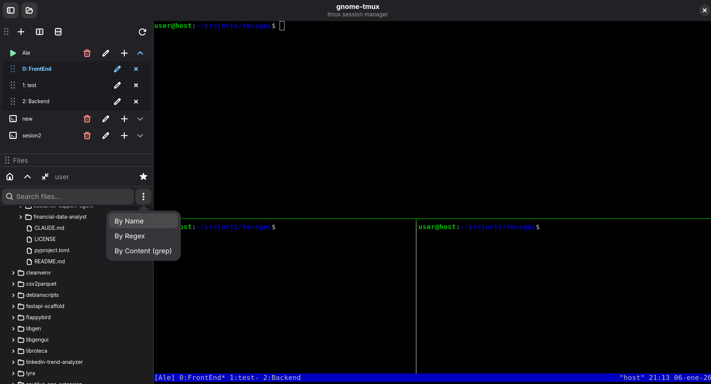
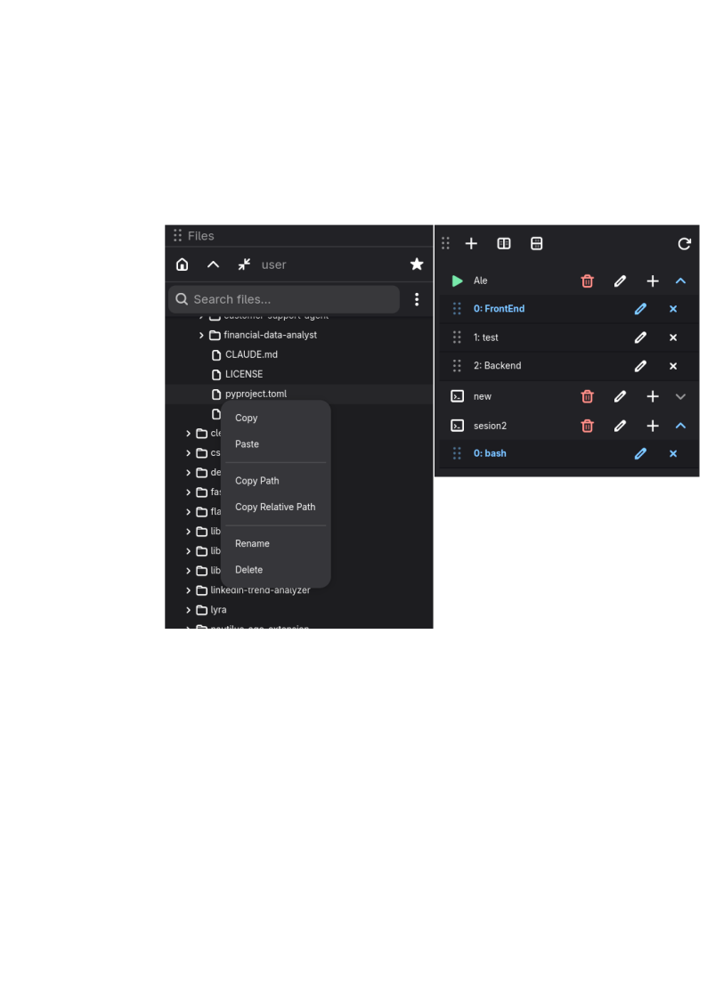
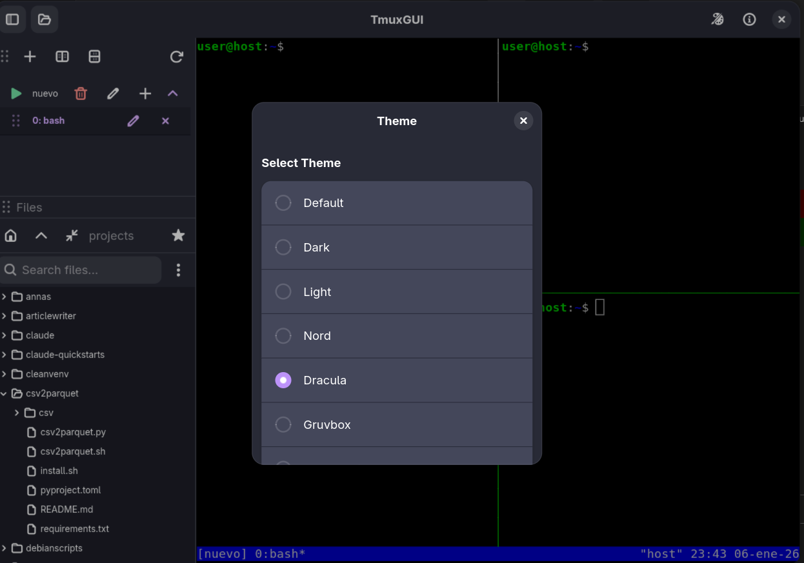

# gnome-tmux

<p align="center">
  
</p>

<p align="center">
  <strong>GNOME native frontend for tmux</strong><br>
  Modern GTK4 + Libadwaita interface for managing tmux sessions
</p>

---

## Features

### Session Management
- List all tmux sessions with attached/detached status
- Create new sessions with custom names
- Delete sessions with confirmation dialog
- Rename sessions inline
- Drag and drop to reorder sidebar sections

### Window Management
- View all windows per session (expandable tree)
- Create new windows in any session
- Rename windows
- Close windows (sends `exit` command)
- Drag and drop to reorder windows within a session
- Click to attach terminal to specific window

### Integrated Terminal
- Embedded VTE terminal
- Auto-attaches to selected session/window
- Full tmux keybinding support
- Detach returns to welcome screen

### File Browser
- Integrated file tree sidebar
- Navigate filesystem
- Create files and folders
- Rename and delete with confirmation
- Drag and drop sections to customize layout

### UI/UX
- Native GNOME look and feel with Libadwaita
- Adaptive layout
- Visual feedback for active sessions/windows
- Drag handles for reorderable elements

## Screenshots

<p align="center">
  
  <br><em>Session and window management with expandable tree view</em>
</p>

<p align="center">
  
  <br><em>Integrated terminal attached to tmux session</em>
</p>

<p align="center">
  
  <br><em>Built-in file browser with drag and drop support</em>
</p>

## Requirements

### System Dependencies
- Python 3.12+
- GTK 4.0
- Libadwaita 1.0
- VTE 3.91 (terminal emulator)
- tmux

### Python Dependencies
- PyGObject (gi)

## Installation

### Debian/Ubuntu

```bash
# Install system dependencies
sudo apt install \
    python3-gi \
    python3-gi-cairo \
    gir1.2-gtk-4.0 \
    gir1.2-adw-1 \
    gir1.2-vte-3.91 \
    tmux

# Clone the repository
git clone https://github.com/vdirienzo/gnome-tmux.git
cd gnome-tmux

# Run the application
./run.py
```

### Fedora

```bash
# Install system dependencies
sudo dnf install \
    python3-gobject \
    gtk4 \
    libadwaita \
    vte291-gtk4 \
    tmux

# Clone and run
git clone https://github.com/vdirienzo/gnome-tmux.git
cd gnome-tmux
./run.py
```

### Arch Linux

```bash
# Install system dependencies
sudo pacman -S \
    python-gobject \
    gtk4 \
    libadwaita \
    vte4 \
    tmux

# Clone and run
git clone https://github.com/vdirienzo/gnome-tmux.git
cd gnome-tmux
./run.py
```

## Usage

### Basic Workflow

1. **Launch the application** - `./run.py`
2. **Sessions appear in sidebar** - Existing tmux sessions are listed automatically
3. **Click a session** - Expands to show windows
4. **Click a window** - Terminal attaches to that window
5. **Create sessions** - Click `+` button in header
6. **Manage windows** - Use buttons on each session/window row

### Keyboard Shortcuts

| Shortcut | Action |
|----------|--------|
| `Ctrl+B d` | Detach from tmux session |
| `Ctrl+B c` | Create new window (in tmux) |
| `Ctrl+B n` | Next window |
| `Ctrl+B p` | Previous window |
| `Ctrl+B %` | Split pane horizontally |
| `Ctrl+B "` | Split pane vertically |

*Standard tmux keybindings work in the embedded terminal*

### Recommended tmux Configuration

For the best experience with gnome-tmux, add this configuration to your `~/.tmux.conf`:

```bash
# Enable full mouse support (select panes, resize, scroll)
set -g mouse on

# Change prefix from Ctrl+b to Ctrl+a (more comfortable, like screen)
set -g prefix C-a
unbind C-b
bind C-a send-prefix

# Intuitive shortcuts for splitting windows
bind v split-window -h  # Split vertically with v
bind h split-window -v  # Split horizontally with h
unbind '"'
unbind %

# Quick reload configuration (without restarting tmux)
bind r source-file ~/.tmux.conf \; display "Configuration reloaded!"

# 256 color support (improves themes in Vim/Neovim)
set -g default-terminal "screen-256color"

# Vim-style keys in copy mode
setw -g mode-keys vi

# Reduce Escape delay (useful with Vim/Neovim)
set -sg escape-time 0

# Navigate panes with Alt + arrows (no prefix needed)
bind -n M-Left select-pane -L
bind -n M-Right select-pane -R
bind -n M-Up select-pane -U
bind -n M-Down select-pane -D

# Better looking status bar
set -g status-bg blue
set -g status-fg white
```

After saving, reload with `tmux source-file ~/.tmux.conf` or restart tmux.

### Drag and Drop

- **Reorder windows**: Drag a window row to swap positions within the same session
- **Reorder sidebar**: Drag the handle (≡) on section headers to swap Sessions/Files sections

## Project Structure

```
tmuxgui/
├── src/
│   └── gnome_tmux/
│       ├── __init__.py
│       ├── main.py              # Application entry point
│       ├── window.py            # Main window with sidebar and terminal
│       ├── tmux_client.py       # Tmux subprocess wrapper
│       └── widgets/
│           ├── __init__.py
│           ├── session_row.py   # Session and window row widgets
│           ├── file_tree.py     # File browser widget
│           └── terminal_view.py # VTE terminal wrapper
├── data/
│   └── icons/                   # Application icons
├── run.py                       # Development launcher
├── pyproject.toml               # Project configuration
└── README.md
```

## Architecture

### Components

| Component | Description |
|-----------|-------------|
| `GnomeTmuxApplication` | Adw.Application subclass, handles lifecycle |
| `MainWindow` | Main window with sidebar (sessions + files) and terminal |
| `TmuxClient` | Wrapper for tmux CLI commands via subprocess |
| `SessionRow` | Adw.ExpanderRow showing session with child windows |
| `WindowRow` | Adw.ActionRow for individual tmux windows |
| `FileTree` | Recursive file browser with CRUD operations |
| `TerminalView` | VTE terminal with tmux attach functionality |

### Data Flow

```
User Action → Widget Signal → MainWindow Handler → TmuxClient → tmux CLI
                                    ↓
                              Refresh UI ← Parse Output
```

## Development

### Running from Source

```bash
# Direct execution
./run.py

# With PYTHONPATH
PYTHONPATH=src python3 -m gnome_tmux.main

# Debug mode (verbose output)
G_MESSAGES_DEBUG=all ./run.py
```

### Code Quality

```bash
# Lint with ruff
uvx ruff check src/

# Auto-fix issues
uvx ruff check --fix src/

# Security scan with semgrep
semgrep scan src/
```

### Project Configuration

The project uses `pyproject.toml` for configuration:
- **ruff**: Linting with E, F, W, I rules (E402 ignored for gi.require_version pattern)

## Contributing

1. Fork the repository
2. Create a feature branch (`git checkout -b feature/amazing-feature`)
3. Commit your changes (`git commit -m 'feat: add amazing feature'`)
4. Push to the branch (`git push origin feature/amazing-feature`)
5. Open a Pull Request

### Commit Convention

We use [Conventional Commits](https://www.conventionalcommits.org/):

- `feat:` New features
- `fix:` Bug fixes
- `docs:` Documentation changes
- `style:` Code style changes (formatting)
- `refactor:` Code refactoring
- `test:` Adding tests
- `chore:` Maintenance tasks

## Changelog

### [0.2.0] - 2026-01-06

#### Added
- Window management (create, rename, close windows)
- Drag and drop for windows within sessions
- Drag and drop for sidebar sections (Sessions/Files)
- File tree browser with CRUD operations
- Inline rename for sessions and windows
- Visual indicators for active windows

#### Changed
- Improved session row with expandable windows
- Better drag handle visibility

### [0.1.0] - 2026-01-06

#### Added
- Initial MVP release
- Session listing with auto-refresh
- Session creation dialog
- Session deletion with confirmation
- Embedded VTE terminal
- Attach to tmux sessions

## License

This project is open source. See LICENSE file for details.

## Author

Homero Thompson del Lago del Terror

---

<p align="center">
  Made with ❤️ for the GNOME community
</p>
